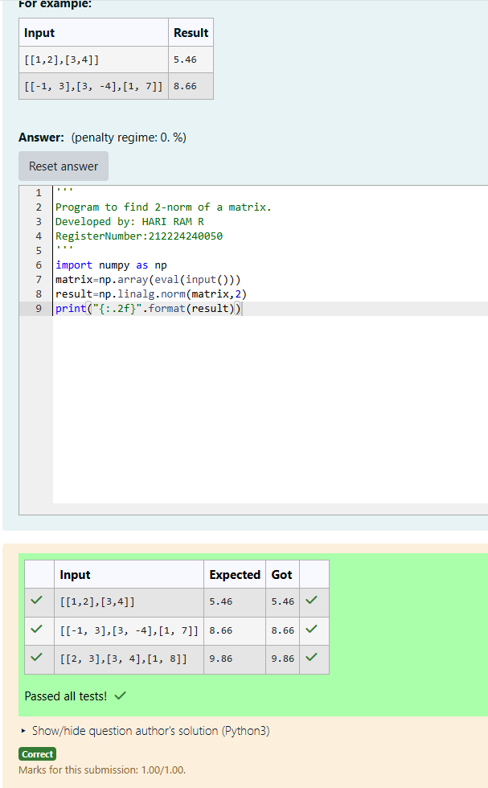
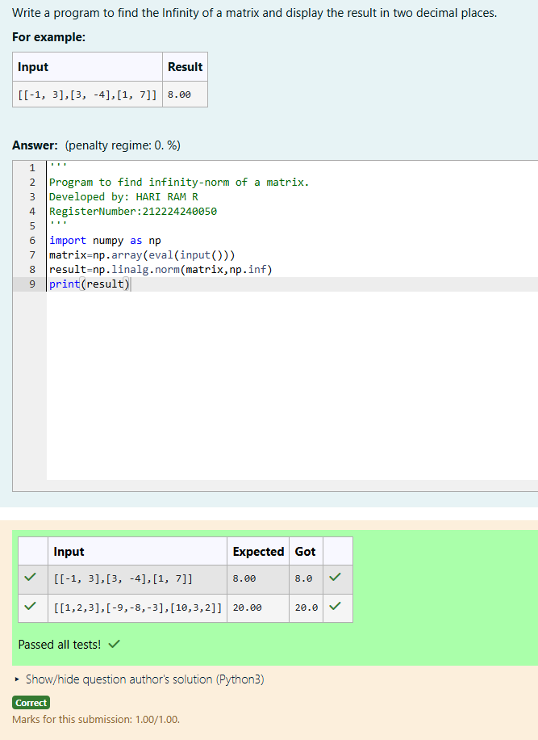

# Norm of a matrix
## Aim
To write a program to find the 1-norm, 2-norm and infinity norm of the matrix and display the result in two decimal places.
## Equipment’s required:
1.	Hardware – PCs
2.	Anaconda – Python 3.7 Installation / Moodle-Code Runner
## Algorithm for 1-Norm of a Matrix
  1. Get the input matrix using np.array()
  2. Find the 1-norm of the matrix using np.linalg.norm()
  3. Print the norm of the matrix in two decimal places.
## Algorithm 2-Norm of a matrix:
  1. Get the input matrix using np.array()
  2.Find the 2-norm of the matrix using np.linalg.norm()
  3. Print the norm of the matrix in two decimal places.
## Algorithm Infinity Norm of a Matrix
  1. Get the input matrix using np.array()
  2. Find the Infinity Norm using np.linalg.norm(matrix, np.inf)
  3. Print the Norm to Two Decimal Places 
## Program:
```Python
# Register No:212224240050
# Developed By:HARI RAM R
# 1-Norm of a Matrix
'''
Program to find 1-norm of a matrix.
Developed by: HARI RAM R
RegisterNumber:212224240050 
'''
import numpy as np
matrix=np.array(eval(input()))
result=np.linalg.norm(matrix,1)
print(result)


# 2-Norm of a Matrix
'''
Program to find 2-norm of a matrix.
Developed by: HARI RAM R
RegisterNumber:212224240050 
'''
import numpy as np
matrix=np.array(eval(input()))
result=np.linalg.norm(matrix,2)
print("{:.2f}".format(result))


# Infinity Norm of a Matrix
'''
Program to find infinity-norm of a matrix.
Developed by: HARI RAM R
RegisterNumber:212224240050 
'''
import numpy as np
matrix=np.array(eval(input()))
result=np.linalg.norm(matrix,np.inf)
print(result)


```
## Output:
### 1-Norm of a Matrix


### 2-Norm of a Matrix


### Infinity Norm of a Matrix


## Result
Thus the program for 1-norm, 2-norm and Infinity norm of a matrix are written and verified.
